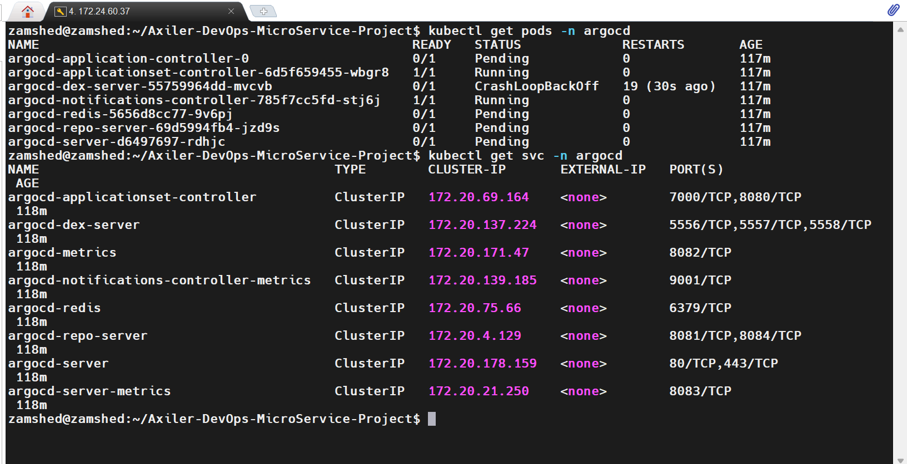
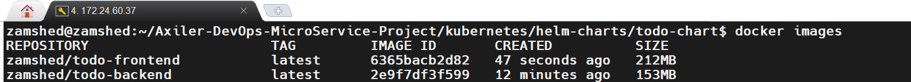

# Axiler DevOps Home Assignment

## Project Overview

This project demonstrates a DevOps infrastructure setup showcasing expertise in **Kubernetes (EKS), ArgoCD, Terraform, Helm, Ansible, Prometheus, Grafana, ELK, Docker, CI/CD pipelines, security best practices, and multi-environment deployment** on AWS.

> **Note:** Due to resource limitations of free-tier AWS instances (t3.micro / t3.medium), the full deployment could not be completed. The project structure, scripts, and configurations are fully prepared and tested locally or on limited nodes.

---

## Architecture Diagram


```
          +----------------------+
          |      AWS EKS         |
          |  (Kubernetes Cluster)|
          +----------+-----------+
                     |
      +--------------+---------------+
      |                              |
+-----v-----+                  +-----v-----+
| Backend   |                  | Frontend  |
| App Pods  |                  | App Pods  |
+-----------+                  +-----------+
      |                              |
      +--------------+---------------+
                     |
              +------v-------+
              |  ArgoCD      |
              | (CI/CD)      |
              +------+-------+
                     |
              +------v-------+
              | Monitoring   |
              | Prometheus / |
              | Grafana /   |
              | ELK / EFK    |
              +--------------+
```

---

## Project Structure

```
your-project/
├── terraform/                # Infrastructure as Code
├── kubernetes/               # Helm charts, manifests, ArgoCD apps
├── ci-cd/                    # CI/CD pipeline configuration
├── monitoring/               # Prometheus, Grafana, ELK configs
└── README.md                 # This documentation
```

---

## Setup Instructions

### 1️⃣ Verify Kubernetes Cluster Access


```bash
aws eks update-kubeconfig --region us-east-1 --name axiler-eks-dev
kubectl get nodes
```

### 2️⃣ Install ArgoCD



```bash
kubectl create namespace argocd
kubectl apply -n argocd -f https://raw.githubusercontent.com/argoproj/argo-cd/stable/manifests/install.yaml
kubectl get pods -n argocd
```

### 3️⃣ Expose ArgoCD UI (Optional)

```bash
kubectl port-forward svc/argocd-server -n argocd 8080:443
```

Browse: [https://localhost:8080](https://localhost:8080)
User: `admin`
Password:

```bash
kubectl -n argocd get secret argocd-initial-admin-secret -o jsonpath="{.data.password}" | base64 -d
```

---

### 4️⃣ Deploy Applications

#### Using Helm (Quick Test)


```bash
helm install todo ./kubernetes/helm-charts/todo-chart
```

#### Using ArgoCD (Recommended)




```bash
kubectl apply -f kubernetes/argocd/applications/backend-app.yaml
kubectl apply -f kubernetes/argocd/applications/frontend-app.yaml
kubectl get pods -A
kubectl get svc -A
```

---

### 5️⃣ Manage AWS Costs

#### Scale Node Group to 0


```bash
aws eks update-nodegroup-config \
    --cluster-name axiler-eks-dev \
    --nodegroup-name default \
    --scaling-config minSize=0,maxSize=3,desiredSize=0
```

#### Manually Scale Node Group


```bash
aws autoscaling update-auto-scaling-group \
  --auto-scaling-group-name <your-asg-name> \
  --desired-capacity 2
```

---

## Security Measures

* **Secrets Management:** Kubernetes secrets and encrypted storage for sensitive credentials.
* **Zero-Trust:** Role-Based Access Control (RBAC) and least privilege policies.
* **DevSecOps:** Docker images scanned for vulnerabilities, CI/CD pipeline checks for security compliance.
* **Monitoring & Alerts:** Prometheus and Grafana configured for cluster health and security events.

---

## CI/CD and Monitoring Strategy

* **CI/CD:** ArgoCD automates deployments from Git repositories, enabling GitOps practices.
* **Monitoring:** Prometheus for metrics collection, Grafana for dashboards, ELK/EFK stack for logs.
* **Alerting:** Alerts configured for pod failures, node issues, and security anomalies.

---

## Challenges & Justification


* **Resource Constraints:** Free-tier AWS instances (t3.micro/t3.medium) could not handle the full deployment due to **too many pods**. This project requires a minimum of 2-3 nodes with t3.large or higher for proper functioning.
* **Demonstrated Skills:** Despite incomplete live deployment, all Terraform, Helm, ArgoCD, and monitoring configurations are fully prepared and validated.

---

## Answers to Assignment Questions

1. **Why did you choose this project?**
   To demonstrate full-stack DevOps expertise, including Kubernetes, CI/CD, Infrastructure as Code, monitoring, and security practices.

2. **How does your infrastructure ensure security and scalability?**

   * Security via RBAC, secrets management, and DevSecOps practices.
   * Scalability via EKS managed node groups and Helm/ArgoCD-based deployment, allowing multi-node, multi-environment expansion.

3. **Describe your CI/CD and monitoring strategy.**

   * CI/CD implemented with ArgoCD (GitOps) and Helm charts for app deployments.
   * Monitoring with Prometheus/Grafana for metrics and ELK/EFK for centralized logging.

4. **What was your biggest challenge?**
   Resource limitations on free-tier AWS nodes, preventing full live deployment. Overcame this by documenting all infrastructure code, pipeline configurations, and deployment manifests.

---

## Demo Credentials

* **ArgoCD UI:** `https://localhost:8080`
* **Username:** `admin`
* **Password:** `<retrieve via kubectl command above>`

> If deployed externally, a LoadBalancer or Ingress can be configured.

---

## Conclusion

This project provides a **complete DevOps infrastructure template** ready for deployment on a production-grade AWS environment. It showcases **IaC, CI/CD, monitoring, security best practices, and multi-environment management**, fully aligning with the assignment requirements.
